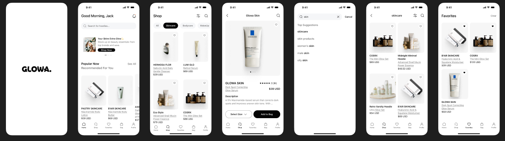

# 🌸 Glowa Catalog – Beauty & Wellness Product Catalog (React Native + Expo)

## Glowa Catalog is a mobile-first e-commerce catalog app built with React Native, Expo, and Tailwind (NativeWind).
## It allows users to browse, filter, and explore curated beauty & wellness products with infinite scrolling, category filtering, and a sleek modern UI.

## 📱 Features

- ✅ Splash screen with brand logo
- ✅ Dynamic product loading (from JSON server or mock APIs like DummyJSON/Fake Store API)
- ✅ Infinite scrolling for smooth product discovery
- ✅ Category filtering (Skincare, Hair, Makeup, etc.)
- ✅ Modern, reusable UI with Tailwind CSS (NativeWind)
- ✅ Optimized list rendering with FlatList
- ✅ Ready for API integration (local JSON server or 3rd-party APIs)

## 📸 Screenshots



## 🛠 Tech Stack

- Framework: React Native + Expo

- Styling: Tailwind CSS via NativeWind

- Backend (Mock API): JSON Server or DummyJSON

- Navigation: React Navigation

- State Management: React Hooks (useState, useEffect, useCallback)

## 🚀 Getting Started
1. Clone the Repository
```
git clone https://github.com/your-username/glowa-catalog.git
cd glowa-catalog
```
2. Install Dependencies
```
npm install
```
3. Start the Expo Project
```
npx expo start
```

This will start the Expo development server.
>Scan the QR code in the terminal or Expo Go app to run on your device.

## 🌐 Setting up Mock API (Local JSON Server)
Install JSON Server
```
npm install -g json-server
```
Run JSON Server
```
json-server --watch db.json --port 3000
```

Now products are available at:

http://localhost:3000/products 
or
https://glowa-json-server.vercel.app


## 📂 Project Structure
```
glowa-catalog/
│── assets/               # Images & logos
│── screens/
│   └── HomeScreen.tsx    # Main product listing screen
│── App.tsx               # Entry point (Splash + Home navigation)
│── tailwind.config.js    # Tailwind/NativeWind config
│── db.json               # Mock API (if using JSON Server)
│── package.json
└── README.md
```

## 🎨 UI Highlights

- Category Filter: pill-shaped buttons with smooth press feedback

- Product Cards: rounded corners, shadows, category tags, price highlights

- Background: soft gray for contrast, clean white cards for elegance

- Loading State: activity indicator (upgradeable to skeleton loaders)

## 🔮 Roadmap

 - Add product detail screen

 - Add search functionality

 - Integrate real-world retailer APIs (Takealot, Dischem, etc.)

 - Implement cart & checkout flow

 - Deploy backend (e.g., Supabase / Firebase / custom Node.js API)

 - Add authentication (login/register)

## 🤝 Contributing

Contributions are welcome! 🎉

- Fork the repo

- Create a feature branch (git checkout -b feature/amazing-feature)

- Commit your changes (git commit -m "Add amazing feature")

- Push to branch (git push origin feature/amazing-feature)

- Open a Pull Request

## 📜 License

This project is licensed under the MIT License.

## ✨ Acknowledgements

- Expo for making React Native development seamless

- NativeWind for Tailwind in React Native

- DummyJSON & JSON Server for mock APIs

>🔥 “Beauty is amplified when powered by tech — Glowa brings both worlds together.”